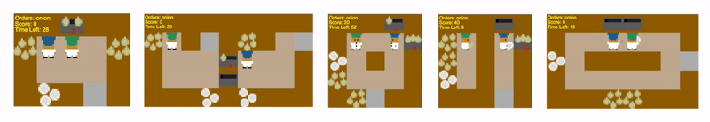

# Overcooked-AI: LLM Agent Edition

<p align="center">
  
</p>

## 🚀 Overview

**Overcooked-AI** is a research platform for human-AI coordination, now supercharged with a modular, extensible **LLM Agent** pipeline. Instead of relying solely on traditional reinforcement learning, this project introduces a novel agent that leverages large language models (LLMs) for action planning, subtask decomposition, and context-aware decision making in the Overcooked environment.

- **Play with or against LLM-powered agents**
- **Natural language planning and action prediction**
- **Memory-augmented context for smarter coordination**
- **Easy to extend with your own LLMs or prompts**

> **Note:** RL/BC agents are still supported, but this README focuses on the new LLM-based agent system.

---

## 🧠 The Overcooked LLM Agent Pipeline

The Overcooked LLM Agent is a modular pipeline that breaks down high-level tasks into actionable steps using a series of specialized LLMs:

1. **State Summarizer**  
   Converts the raw Overcooked game state into a concise, human-readable summary (using a Gemma LLM).

2. **Subtask Creator**  
   Given a goal (e.g., "Serve Onion Soup"), generates a numbered list of atomic subtasks using a Llama3-based LLM and prompt engineering.

3. **Task Tagger**  
   Classifies each subtask as "primary" (requires coordination) or "secondary" (supportive), again using a Llama3 LLM.

4. **Action Predictor**  
   Given the current state summary and the plan, predicts the next primary and secondary actions to execute (Gemma LLM).

5. **Vector Memory**  
   Stores and retrieves context from past interactions using FAISS and HuggingFace embeddings, enabling context-aware planning and adaptation.

All LLMs are served locally via [Ollama](https://ollama.com/) for fast, private inference.

---

## ✨ Features

- **LLM-driven agent**: Plans and acts using natural language, not just hardcoded policies.
- **Contextual memory**: Remembers past plans and adapts to user preferences.
- **Modular pipeline**: Swap out or extend any LLM component (state summarizer, subtask creator, etc.).
- **Web demo**: Play Overcooked with the LLM agent in your browser.
- **Easy extensibility**: Add new recipes, layouts, or LLM models with minimal code changes.

---

## 🖥️ Demo: Play with the LLM Agent

### 1. Prerequisites
- Python 3.10
- [Docker](https://docs.docker.com/get-docker/) (for the web demo and Ollama models)
- [Ollama](https://ollama.com/) (for local LLM inference)

### 2. Quickstart (Web Demo)

```bash
# From the project root
cd src/overcooked_demo
./up.sh  # or ./up.sh production for production mode
```

- Open your browser to [http://localhost](http://localhost)
- Select the **Overcooked LLM Agent** as your partner or opponent
- Play and watch the LLM agent plan, adapt, and act in real time!

To stop the server:
```bash
./down.sh
```

### 3. Using the LLM Agent in Python

You can also use the LLM agent directly in your own scripts:

```python
from overcooked_demo.server.llm.agents.action_predictor import ActionPredictorAgent
agent = ActionPredictorAgent()
# ... set up your Overcooked environment and use agent.action(state)
```

---

## 🧩 How the LLM Agent Works

- **State summarization**: Converts game state to a natural language summary for the LLM.
- **Subtask planning**: LLM generates a step-by-step plan for the current goal.
- **Task tagging**: LLM classifies subtasks for better coordination.
- **Action prediction**: LLM selects the next best action based on the plan and current state.
- **Memory/context**: Vector memory enables the agent to remember and adapt to past strategies and user preferences.

All LLM prompts and models are fully customizable—see the `src/overcooked_demo/ollama_models/` directory for prompt templates and model configs.

---

## 🛠️ Extending & Customizing the LLM Agent

- **Swap LLMs**: Edit the `Modelfile` in `src/overcooked_demo/ollama_models/` to use your own models or prompts.
- **Add new recipes/tasks**: Update the subtask creator prompt and logic.
- **Change memory behavior**: Modify `vector_memory.py` for different context retrieval strategies.
- **Integrate new LLM endpoints**: Update the agent pipeline to call your own APIs or local models.

---

## 📁 Project Structure (Key Parts)

- `src/overcooked_demo/server/llm/agents/` — LLM agent modules (action predictor, subtask creator, etc.)
- `src/overcooked_demo/ollama_models/` — LLM model configs and prompt templates
- `src/overcooked_demo/server/llm/memory/` — Vector memory for context
- `src/overcooked_demo/server/llm/orchestrator/` — Pipeline/router logic
- `src/overcooked_demo/server/app.py` — Web server entry point

---

## 👤 Authors & Acknowledgments

- **Lead LLM Agent Developer:** Vito Rizzuto  
- **Original Overcooked-AI:** Micah Carroll (mdc@berkeley.edu), Center for Human-Compatible AI
- Special thanks to the open-source LLM and RL communities.

---

## 📜 License

This project is licensed under the MIT License. See [LICENSE](LICENSE) for details.

---

## 🔗 References & Further Reading

- [Ollama: Run open LLMs locally](https://ollama.com/)
- [Overcooked-AI (original)](https://github.com/HumanCompatibleAI/overcooked_ai)
- [On the Utility of Learning about Humans for Human-AI Coordination (NeurIPS 2019)](https://arxiv.org/abs/1910.05789)
